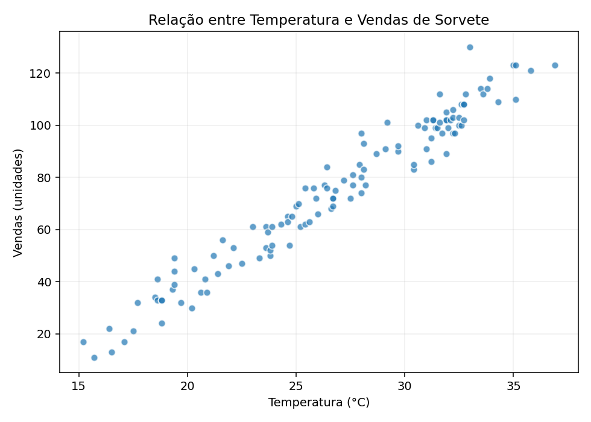
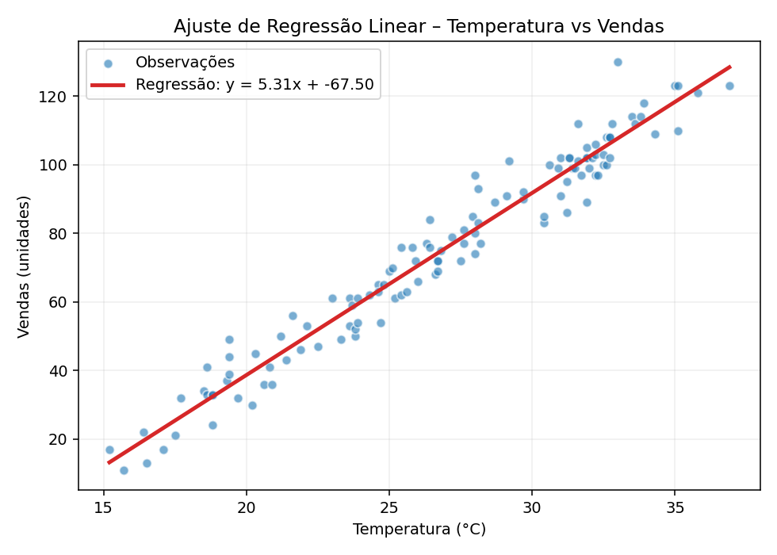

# 🍦 Gelato Mágico – Previsão de Vendas com Machine Learning

Este projeto prevê **vendas de sorvete** com base na **temperatura (°C)**, utilizando **Regressão Linear** e **MLflow** para rastreio de experimentos. Ele foi preparado para compor um **portfólio profissional** e facilitar **reprodutibilidade**, **deploy simples** e **insights visuais**.

> Cenário: você é dono(a) de uma sorveteria e deseja **planejar a produção** para reduzir desperdícios e não perder vendas em dias quentes.

---

## 📁 Estrutura
```
gelato-magico-ml/
├── inputs/
│   └── sentences.txt
├── data/
│   └── ice_cream_sales.csv
├── src/
│   ├── train.py
│   ├── predict.py
│   ├── serve.py
│   └── utils.py
├── reports/
│   └── figures/
│       ├── relacao_temp_vendas.png
│       └── regressao_linear.png
├── requirements.txt
├── README.md
└── .gitignore
```

---

## 🔧 Como rodar (local)
1. **Crie e ative** um ambiente virtual (recomendado):
   ```bash
   python -m venv .venv
   # Windows: .venv\Scripts\activate
   # Linux/Mac: source .venv/bin/activate
   ```
2. **Instale dependências**:
   ```bash
   pip install -r requirements.txt
   ```
3. **Treine o modelo** (com MLflow rastreando o experimento):
   ```bash
   python src/train.py --test_size 0.2 --random_state 42 --experiment gelato-magico
   ```
4. **Faça uma predição rápida**:
   ```bash
   python src/predict.py 30
   ```
5. **Inicie a API (opcional)**:
   ```bash
   uvicorn src.serve:app --reload --port 8000
   # Teste: http://127.0.0.1:8000/predict?temperatura=30
   ```
6. **Abrir MLflow UI** (opcional):
   ```bash
   mlflow ui --port 5000
   # Acesse: http://127.0.0.1:5000
   ```

---

## 📊 Insights Visuais

**Relação entre temperatura e vendas**:



**Ajuste de regressão linear**:



> Observações:
> - Existe uma **correlação positiva** clara: dias mais quentes → mais vendas.
> - Um modelo de **Regressão Linear** já captura bem essa dinâmica.
> - Métricas como **MSE** e **R²** são registradas no **MLflow**.

---

## 🧠 Pipeline do Projeto
- **Dados**: `data/ice_cream_sales.csv` (sintético) – você pode substituir por dados reais.
- **Treino**: `src/train.py` (gera `model/modelo_sorvete.joblib` e logs no MLflow).
- **Predição**: `src/predict.py` (lê o modelo salvo) e `src/serve.py` (API FastAPI).
- **Rastreio**: Experimentos registrados no MLflow: parâmetros, métricas e artefatos.

---

## 🚀 Próximos Passos (Ideias de melhoria)
- Testar **modelos alternativos** (RandomForest, XGBoost, SVR) e comparar no MLflow.
- Incluir variáveis: **umidade**, **dia da semana**, **feriados**.
- Criar **deploy** em cloud (Render/Railway/Azure) para previsões em tempo real.
- Automatizar **pipeline** com GitHub Actions e/ou orquestradores (Prefect/Airflow).
- Criar **dashboard** (Power BI / Plotly Dash) consumindo a API.

---

## 🧪 Datasets e Reprodutibilidade
- O dataset atual é **sintético** e foi gerado para demonstração.
- Substitua por dados reais para ganhos práticos.

---

---

Se este template ajudou, deixe uma ⭐ no repositório quando publicar no GitHub!
